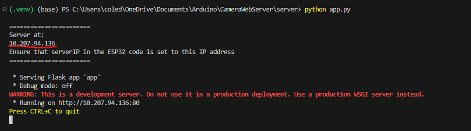
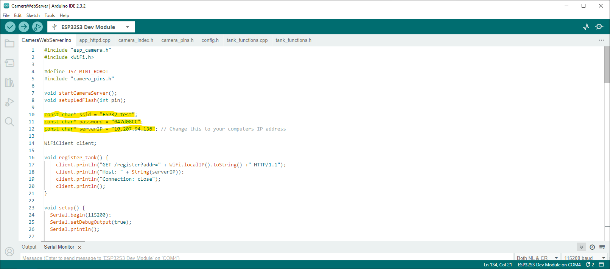

# esp32-tanks

## Instructions

### Setting up the server
1. Clone this repo \
`git clone --branch ml-vision https://github.com/Barnard-PL-Labs/esp32-tanks.git`
2. Enter the __server__ directory \
`cd server`
3. Create a virtual environment and install requirements \
`python -m venv .venv` \
`.venv/Scripts/activate` \
`pip install -r requirements.txt`
4. Start the server \
`python app.py`
5. Record your IP address reported by the server (for the next part) \

### Setting up the tank network 
1. Set up a personal hotspot from your computer (Instructions for windows, anyone with a mac, feel free to add) \
__Settings__ > __Network and Internet__ > __Mobile hotspot__ > toggle the slider to "On"
    - Also make sure you are on the 2.4 GHz Band

2. Copy the network name and password. These should match the _ssid_ and _password_ variables in __CameraWebServer.ino__.

3. Update the _ssid_, _password_, and _serverIP_ variables in __CameraWebServer.ino__ to match your network name, password, and IP address, respectively.

4. Flash the __CameraWebServer.ino__ code to the ESP32 tank

5. If all goes well, turn the tank on and the camera feed should show up automatically

## Repeat Use
1. The server can be started up with `python app.py` once set up. Make sure to do this first.
2. Turn the tank on to create a new connection.

Thats it. Unless:
- Your IP changes (this happens pretty often), in which case you just need to restart the server to find your new IP and update the code

## Next Steps
1. ~~Create an flask server to grab the IP & automatically stream~~
2. Merge the code with existing command functions from Network team
2. Pythonize the existing commands so the server can run them
3. Decide on the Navigation System (Goals, methods, etc.)

## Teams
Network & Distributed Systems Team:
- Brennen
- Jesse
- Nick
- Annie
- Faustina
- Zac

UI
- Han (hanvitC)
- Seongho (seongholee4)
- Nira (niranair01)
- Evan (esk2188)

ML
- Cole (nad2168)
- Nick (ntb2135)
- Em (eas2287)
- Keir (kk3610)