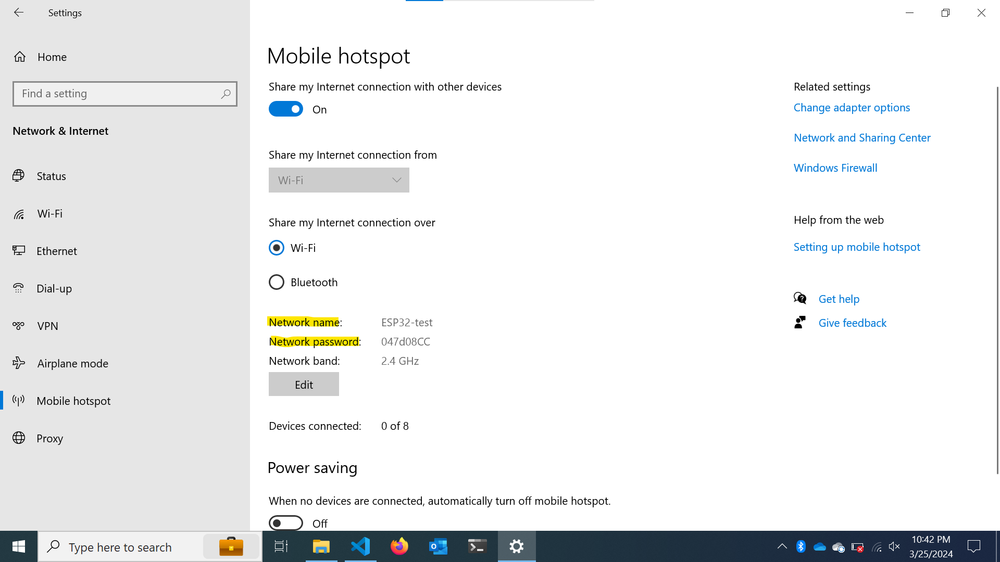

# esp32-tanks

## Instructions

### Setting up the server
1. Clone this repo \
`git clone --branch ml-vision https://github.com/Barnard-PL-Labs/esp32-tanks.git`
2. Enter the __server__ directory \
`cd server`
3. Create a virtual environment and install requirements \
`python -m venv .venv` \
`.venv/Scripts/activate` \
`pip install -r requirements.txt`

### Setting up the tank network 
1. Set up a personal hotspot from your computer (Instructions for windows, anyone with a mac, feel free to add) \
__Settings__ > __Network and Internet__ > __Mobile hotspot__ > toggle the slider to "On"
    - Also make sure you are on the 2.4 GHz Band

2. Copy the network name and password. These should match the _ssid_ and _password_ variables in __CameraWebServer.ino__. Change them as necessary.
    - I find it easier to just change the settings on the personal hotspot to match, rather than re-flash the code a bunch

3. Flash the __CameraWebServer.ino__ code to the ESP32 tank

## Use
1. Connect the tank to the Serial Monitor with a cable
2. Turn on the tank
3. Copy the IP address of the tank from the serial monitor
4. Go to the __server__ directory and run the StreamReader.py file. Example:\
`python StreamReader.py 192.168.137.81`

## Next Steps
1. Create an flask server to grab the IP & automatically stream
2. Merge the code with existing command functions from Network team
2. Pythonize the existing commands so the server can run them
3. Decide on the Navigation System (Goals, methods, etc.)

## Teams
Network & Distributed Systems Team:
- Brennen
- Jesse
- Nick
- Annie
- Faustina
- Zac

UI
- Han (hanvitC)
- Seongho (seongholee4)
- Nira (niranair01)
- Evan (esk2188)

ML
- Cole (nad2168)
- Nick (ntb2135)
- Em (eas2287)
- Keir (kk3610)